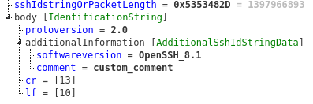
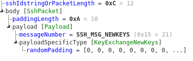
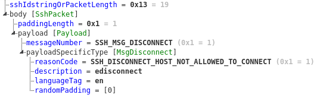

## Kaitai SSH parser

#### Description
The goal of this project is to create a parser of SSH protocol messages using Kaitai.<br>
**Author**: Patrik Holop (xholop01)

#### Documentation and references

##### SSH protocol
Structure of SSH protocol messages is described in [RFC 4253](https://tools.ietf.org/html/rfc4253).<br>
More precise documentation for SSH ranges from [RFC 4250](https://tools.ietf.org/html/rfc4250) to [RFC 4256](https://tools.ietf.org/html/rfc4256).<br>
Another used resources was an [overview of SSH structure for traffic analysis](https://www.trisul.org/blog/traffic-analysis-of-secure-shell-ssh/).

##### Kaitai

[Kaitai Struct User Guide](https://doc.kaitai.io/user_guide.html)<br>
[KSY Style Guide](https://doc.kaitai.io/ksy_style_guide.html)

##### Versions

This parser (`parser.ksy`) is able to parse protocol messages for SSHv2.<br>
*Based on RFC: "Earlier versions of this protocol have not been formally documented."* This means that we would be unable to create a formal parser for previous versions.

#### Parser

*Disclaimer: Examples provided by official pages of Kaitai Struct do not contain direct examples of SSH protocol except parsing of [SSH public keys](https://formats.kaitai.io/ssh_public_key/index.html), which was not goal of this project and the parser was NOT inspired by an existing project.*

##### Metadata information
Section `meta` contains basic data about the parser, reference to documentation (`xref`), specification of supported file extension  `bin`, encoding, etc.

##### SSH version exchange ([RFC](https://tools.ietf.org/html/rfc4253#section-4.2))

Firstly, SSH identification must be exchanged after establishing a connection. It has the following format:<br>
```SSH-protoversion-softwareversion SP comments CR LF```

It must start with a string `SSH-` followed by a version `2.0`, software version like `OpenSSHv1`. Comments are optional and typically not used.

Corresponding type in Kaitai parser is `identification_string`. Since `comments` section is fully optional and the space `SP` is present only if the comment is as well, parser creates a substream up to `CR` and parses it accordingly. For possible compatibility with older version this parser does not enforce version `2.0`.

##### SSH packet ([RFC](https://tools.ietf.org/html/rfc4253#section-6))

After the exchange of SSH identification strings, all messages have the following structure:
```
uint32    packet_length
byte      padding_length
byte[n1]  payload; n1 = packet_length - padding_length - 1
byte[n2]  random padding; n2 = padding_length
byte[m]   mac (Message Authentication Code - MAC); m = mac_length
```
A corresponding type in Kaitai parser is `ssh_packet`. Packet length does not take into account sequence `mac` or the field `packet_length` itself. Payload has a corresponding type `payload`. `Random padding` and `mac` are parsed as a part of payload (See section **Encrypted packets**). Payload further specifies `message_number` that is used to differentiate between types of messages ([RFC](https://tools.ietf.org/html/rfc4253#section-12)). For this purpose is used Kaitai enum `message_numbers`.

##### SSH version exchange vs SSH packet
Kaitai is a tool designed for non-ambiquos data structures. Since SSH identification string and other packets have completely different structure and there is no common field that will specify the type of message, stateless parser does not know whether is parses one or the other. That's why the first 4 bytes of the parsed sequence is called `ssh_idstring_or_packet_length`. If this field contains value `SSH-`, parser expects that it is an identification string, otherwise packet length of SSH packet.


##### Negotiation of algorithms for key exhange ([RFC](https://tools.ietf.org/html/rfc4253#section-7.1))

The next step is to negotiate algorithms used for key exchange and messages have the following structure (parser structure name: `key_exchange_init`):
```
      byte         SSH_MSG_KEXINIT
      byte[16]     cookie (random bytes)
      name-list    kex_algorithms
      name-list    server_host_key_algorithms
      name-list    encryption_algorithms_client_to_server
      name-list    encryption_algorithms_server_to_client
      name-list    mac_algorithms_client_to_server
      name-list    mac_algorithms_server_to_client
      name-list    compression_algorithms_client_to_server
      name-list    compression_algorithms_server_to_client
      name-list    languages_client_to_server
      name-list    languages_server_to_client
      boolean      first_kex_packet_follows
      uint32       0 (reserved for future extension)
```
Repeating values withing `name-list` are represented by parser type `algorithm_list`.

##### Diffie-Hellman Key exchange ([RFC](https://tools.ietf.org/html/rfc4253#section-8))
RFC further describes Diffie-Hellman as a method for key exchange and it follows the phase of algorithm negotiation. Firstly, there is an initiation identified by message type `SSH_MSG_KEXDH_INIT` and client passes a length of multiprecision integer and a computed value of `e`. Server responds with the computed value of `f` and signature of `H` as well as the public host key and certificates (message type `SSH_MSG_KEXDH_REPLY`). According to RFC:
```
   First, the client sends the following:

      byte      SSH_MSG_KEXDH_INIT
      mpint     e

   The server then responds with the following:

      byte      SSH_MSG_KEXDH_REPLY
      string    server public host key and certificates (K_S)
      mpint     f
      string    signature of H
```
Parser types for this part of communication are `diffie_helman_init` and `diffie_helman_reply`.

This process is repeated until a message type `SSH_MSG_NEWKEYS` is sent (parser type `key_exchange_new_keys`). This message contains empty payload and is used only for notification. Otherwise, `SSH_MSG_DISCONNECT` is sent.

##### Encrypted packets ([RFC](https://tools.ietf.org/html/rfc4253#section-6.3))
Once both sides have everything needed for an encrypted communication, packets will be encrypted. There are multiple problem for stateless identification of encrypted packets. Since SSH relies heavily on the handshake described in previous section, size of `mac` sequence is unknown for the parser and packet length excludes this sequence. For this purpose parser uses the best guess of `16B` variant, since this value was used for encryption of captured communication.<br>
For the same reason described in section **SSH version exchange vs SSH packet**, an ambiquous design of SSH messages forces the parser to quess which packets are encrypted. The encrypted payload begins immediatelly after the packet length, which breaks the general SSH packet structure. This is fixed by determination of the message type via heuristic. If the first value after `packet_length` is not recognized as a valid message type (enum `message_types`), it is considered to be an encrypted packet. That is why padding length and message number represent a part of encrypted payload in the mentioned case.

##### Disconnection messages ([RFC](https://tools.ietf.org/html/rfc4253#section-11.1))

At any time, any side of the communication can send a disconnection message in the following format:
```
byte      SSH_MSG_DISCONNECT
uint32    reason code
string    description in ISO-10646 UTF-8 encoding [RFC3629]
string    language tag [RFC3066]
```

All strings end with an empty byte. Because disconnection messages are very rarely sent in an unencrypted communication, this feature was tested on manually crafted binary files.

##### Debug and reserved messages ([RFC](https://tools.ietf.org/html/rfc4253#section-11.3))

Debug messages (parser type `msg_debug`) can be sent for various debugging purposes and have the following structure:
```
byte      SSH_MSG_DEBUG
boolean   always_display
string    message in ISO-10646 UTF-8 encoding [RFC3629]
string    language tag [RFC3066]
```

Reserved or unimplemented messages are sent if the message is not recognized but may have various use cases in the future. For this type of messages parser uses type `msg_unimplemented`). 

#### Examples of parsed messages

##### SSH identification string



##### SSH key exchange init


##### SSH Diffie Hellman


##### SSH new keys



##### SSH disconnection message



##### SSH debug message


##### SSH unimplemented message


##### SSH encrypted packet


#### Dataset description

Dataset representing captured network communication is located in the folder `data`.

Many of the below-mentioned files are part of the following communication: `data/communication.pcapng `

Dataset files:
- `1_client_protocol.bin`, `1_client_protocol.pcap` <br>
  SSH identification string of the client
- `1_client_protocol_with_comment.bin` <br>
  SSH identification string containing custom comment. Manually crafted file.
- `2_server_protocol.bin`, `2_server_protocol.pcap` <br>
  SSH identification string of the server.
- `3_client_key_exchange_init.bin`, `3_client_key_exchange_init.pcap` <br>
  Client initiation of key exchange.
- `4_server_key_exchange_init.bin`, `4_server_key_exchange_init.pcap` <br>
  Server's response to client initiation request.
- `5_client_diffie_helman.bin`, `5_client_diffie_helman.pcap` <br>
  Client initiation of Diffie-Hellman key exchange.
- `6_server_diffie_hellman_key_exchange_reply.bin`, `6_server_diffie_hellman_key_exchange_reply.pcap` <br>
  Servers response to DH key exchange.
- `6_1_server_diffie_hellman_key_exchange_reply.bin` <br>
  Servers response to DH key exchange, alternative values.
- `6_2_new_keys.bin`, `6_server_diffie_hellman_key_exchange_reply.pcap` <br>
  Servers response with new keys.
- `7_client_new_keys.bin`, `7_client_new_keys.pcap` <br>
  Client new keys message.
- `8_client_encrypted_packet.bin`, `8_client_encrypted_packet.pcap` <br>
  Encrypted message sent by client.
- `9_server_encrypted_packet.bin`, `9_server_encrypted_packet.pcap` <br>
  Encrypted message sent by server.
- `ssh_debug_msg.bin` <br>
  SSH debug message, manually crafted.
- `ssh_disconnection_msg.bin` <br>
  SSH disconnection message, manually crafted.
- `ssh_unimplemented_msg.bin` <br>
  SSH reservation message, manually crafted.

Streams:
- Folder `data/streams` contain binary streams of multiple messages. Each file from `comm.bin` to `comm9.bin` contains the whole binary stream except the previously parsed messages, so `comm.bin` contains the whole communication and `comm9.bin` only the last left message.
